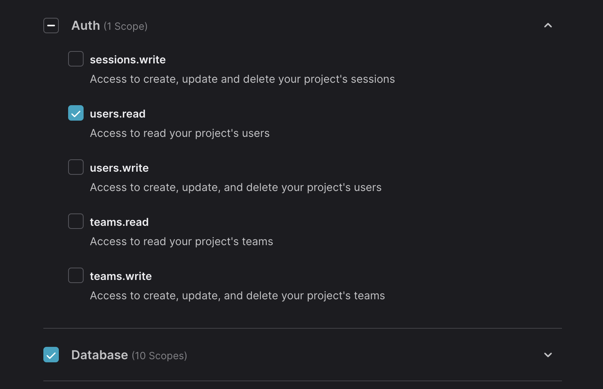

# Quick Start

WIP

## Installation

```bash
bun add dbwrite
```

(or)

```bash
npm i dbwrite
```

## Appwrite API

Has access to

- `users.read` permission from `Auth` scope
  - To get the current user
  - If you didn't, the user ID of a document will be an empty string. [[learn more](/)]
- `Database` scope permission.


